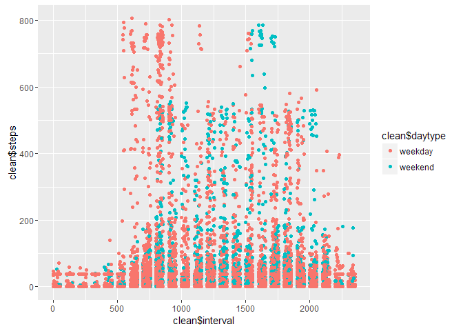

# Reproducible Research: Peer Assessment 1

```r
library(knitr)
opts_chunk$set(echo = TRUE)
```

## Loading and preprocessing the data

```r
library(dplyr)
library(lubridate)
library(ggplot2)
library(Hmisc)
```

```
## Warning: replacing previous import by 'ggplot2::arrow' when loading 'Hmisc'
```

```
## Warning: replacing previous import by 'ggplot2::unit' when loading 'Hmisc'
```

```
## Warning: replacing previous import by 'scales::alpha' when loading 'Hmisc'
```

```r
### Read in data 
activity <- read.csv("activity.csv" )
# make dates in POSIXtl form in order to use its methods
#activity$date <-as.POSIXlt(activity$date)
# return dates to Date class
activity$date <- as.Date(activity$date)
# create a new column with day names
activity$day<-factor(weekdays(activity$date))
# use the names to create a factor variable 2 levels:weekdays/weekends
activity$daytype<-factor(activity$day%in% c("Saturday","Sunday"),labels=c('weekday', 'weekend'))

#Quick look 
summary(activity)#NA's   :2304   
```

```
##      steps             date               interval             day      
##  Min.   :  0.00   Min.   :2012-10-01   Min.   :   0.0   Friday   :2592  
##  1st Qu.:  0.00   1st Qu.:2012-10-16   1st Qu.: 588.8   Monday   :2592  
##  Median :  0.00   Median :2012-10-31   Median :1177.5   Saturday :2304  
##  Mean   : 37.38   Mean   :2012-10-31   Mean   :1177.5   Sunday   :2304  
##  3rd Qu.: 12.00   3rd Qu.:2012-11-15   3rd Qu.:1766.2   Thursday :2592  
##  Max.   :806.00   Max.   :2012-11-30   Max.   :2355.0   Tuesday  :2592  
##  NA's   :2304                                           Wednesday:2592  
##     daytype     
##  weekday:12960  
##  weekend: 4608  
##                 
##                 
##                 
##                 
## 
```
## What is mean total number of steps taken per day?

```r
## with NAs not removed 
daytotals <- tapply(activity$steps, activity$date, sum)
#histogram of daily totals
hist(daytotals, breaks = 61)  # 61 days 
```

 

```r
summary(daytotals) ##median: 10760    mean: 10770
```

```
##    Min. 1st Qu.  Median    Mean 3rd Qu.    Max.    NA's 
##      41    8841   10760   10770   13290   21190       8
```

```r
#Using the mean function needs NAs removed
mean(daytotals,na.rm=T) #but with the 8 days removed mean: 10766.19
```

```
## [1] 10766.19
```

```r
median(daytotals,na.rm=T) ## median : 10765
```

```
## [1] 10765
```

```r
# or with dplyr
# You can use data frame or make a data table
# activitydf<-tbl_df(activity)
## daily sum ,NAs included
dsum <-summarise(group_by(activity,date), s = sum(steps))
summary(dsum)
```

```
##       date                  s        
##  Min.   :2012-10-01   Min.   :   41  
##  1st Qu.:2012-10-16   1st Qu.: 8841  
##  Median :2012-10-31   Median :10765  
##  Mean   :2012-10-31   Mean   :10766  
##  3rd Qu.:2012-11-15   3rd Qu.:13294  
##  Max.   :2012-11-30   Max.   :21194  
##                       NA's   :8
```

```r
plot(dsum,type="l")##NAs producing gaps in the plot
```

 

```r
hist(dsum$s,breaks=17568/1000,main="Histogram of Daily Sums Frequency")
```

 

```r
##daily mean, NAs included
dmean <-summarise(group_by(activity,date),m=mean(steps))
summary(dmean)
```

```
##       date                  m          
##  Min.   :2012-10-01   Min.   : 0.1424  
##  1st Qu.:2012-10-16   1st Qu.:30.6979  
##  Median :2012-10-31   Median :37.3785  
##  Mean   :2012-10-31   Mean   :37.3826  
##  3rd Qu.:2012-11-15   3rd Qu.:46.1597  
##  Max.   :2012-11-30   Max.   :73.5903  
##                       NA's   :8
```

```r
plot(dmean,type="l")##NAs producing gaps
```

 

```r
## Examining by interval (288 intervals per day)
###by interval sum,NAs removed 
isum <-summarise(group_by(activity,interval), s = sum(steps,na.rm=T))
summary(isum)
```

```
##     interval            s          
##  Min.   :   0.0   Min.   :    0.0  
##  1st Qu.: 588.8   1st Qu.:  131.8  
##  Median :1177.5   Median : 1808.0  
##  Mean   :1177.5   Mean   : 1981.3  
##  3rd Qu.:1766.2   3rd Qu.: 2800.2  
##  Max.   :2355.0   Max.   :10927.0
```

```r
plot(isum,type="l",ylab="Step sum",main="Sum per interval across all days")
```

 

```r
hist(isum$s,breaks=17568/1000,main="Histogram of per Interval Sums Frequency")
```

 

## What is the average daily activity pattern?
## 1.Make a time series plot of the 5-minute interval(x-axis)
## and the average number of steps taken,averaged across all days (y-axis)

```r
##by interval mean daily steps,NAs removed
imean<-summarise(group_by(activity,interval),m=mean(steps,na.rm=T))
summary(imean)
```

```
##     interval            m          
##  Min.   :   0.0   Min.   :  0.000  
##  1st Qu.: 588.8   1st Qu.:  2.486  
##  Median :1177.5   Median : 34.113  
##  Mean   :1177.5   Mean   : 37.383  
##  3rd Qu.:1766.2   3rd Qu.: 52.835  
##  Max.   :2355.0   Max.   :206.170
```

```r
plot(imean,type="l",xlab="Intervals",ylab="mean steps",main="Weekly mean by interval")
```

 

```r
hist(imean$m,breaks=17568/1000,main="Histogram of per Interval Means Frequency")
```

 

## What is the average daily activity pattern?

```r
#we can plot a Breakdown of steps by day of the week(by name)

meandaytotal<-aggregate(activity$steps, by=list(interval = activity$interval,day = activity$day), FUN=mean,na.rm=T)

library(ggplot2)
ggplot(data = meandaytotal, aes(interval, x, group=day)) +
  geom_line() +
  facet_grid(day ~. ) +
  xlab("Time Interval") +
  ylab("Mean Number of Steps") +
  ggtitle("Mean Number of Steps versus Time Interval")
```

 

```r
##qplot 
qplot(meandaytotal$interval,meandaytotal$x,colour=meandaytotal$day)
```

 

## 2.Which 5-minute interval, on average across all the days in the dataset,contains the maximum number of steps?

```r
## biggest value of mean steps per 5 minute interval 
which.max((isum$s))#result is interval 104
```

```
## [1] 104
```

```r
##get the value of the 104 interval
isum[104,]
```

```
## Source: local data frame [1 x 2]
## 
##   interval     s
## 1      835 10927
```

```r
#gives the value of  10927(most steps/interval across all days)
#Or we can examine the averages across all days ,and find that the
#same interval(104)has the highest average ,with 206.16
which.max((imean$m))
```

```
## [1] 104
```

```r
imean[which.max(imean$m),]
```

```
## Source: local data frame [1 x 2]
## 
##   interval        m
## 1      835 206.1698
```

## Imputing missing values

```r
# NA substituted with mean values
clean<-activity
clean$steps  <- with(activity, impute(steps, mean))
summary(clean)#reports all details
```

```
## 
##  2304 values imputed to 37.3826
```

```
##      steps             date               interval             day      
##  Min.   :  0.00   Min.   :2012-10-01   Min.   :   0.0   Friday   :2592  
##  1st Qu.:  0.00   1st Qu.:2012-10-16   1st Qu.: 588.8   Monday   :2592  
##  Median :  0.00   Median :2012-10-31   Median :1177.5   Saturday :2304  
##  Mean   : 37.38   Mean   :2012-10-31   Mean   :1177.5   Sunday   :2304  
##  3rd Qu.: 37.38   3rd Qu.:2012-11-15   3rd Qu.:1766.2   Thursday :2592  
##  Max.   :806.00   Max.   :2012-11-30   Max.   :2355.0   Tuesday  :2592  
##                                                         Wednesday:2592  
##     daytype     
##  weekday:12960  
##  weekend: 4608  
##                 
##                 
##                 
##                 
## 
```

```r
##Repeating the analysis from the start for imputed set
## with NAs not removed 
daytotals <- tapply(clean$steps, clean$date, sum)
#histogram of daily totals
hist(daytotals, breaks = 61)  # 61 days 
```

 

```r
summary(daytotals) ##median: 10770    mean: 10770
```

```
##    Min. 1st Qu.  Median    Mean 3rd Qu.    Max. 
##      41    9819   10770   10770   12810   21190
```

```r
#Using the mean function needs NAs removed
mean(daytotals,na.rm=T) #but with the 8 days removed mean: 10766.19
```

```
## [1] 10766.19
```

```r
median(daytotals,na.rm=T) ## median : 10765
```

```
## [1] 10766.19
```

```r
# or with dplyr
# You can use data frame or make a data table
# activitydf<-tbl_df(activity)
## daily sum ,NAs included
dsum <-summarise(group_by(clean,date), s = sum(steps))
summary(dsum)
```

```
##       date                  s        
##  Min.   :2012-10-01   Min.   :   41  
##  1st Qu.:2012-10-16   1st Qu.: 9819  
##  Median :2012-10-31   Median :10766  
##  Mean   :2012-10-31   Mean   :10766  
##  3rd Qu.:2012-11-15   3rd Qu.:12811  
##  Max.   :2012-11-30   Max.   :21194
```

```r
plot(dsum,type="l")##No gaps in the plot
```

 

```r
hist(dsum$s,breaks=17568/1000,main="Histogram of Daily Sums Frequency")
```

 

```r
##daily mean, NAs included
dmean <-summarise(group_by(clean,date),m=mean(steps))
summary(dmean)
```

```
##       date                  m          
##  Min.   :2012-10-01   Min.   : 0.1424  
##  1st Qu.:2012-10-16   1st Qu.:34.0938  
##  Median :2012-10-31   Median :37.3826  
##  Mean   :2012-10-31   Mean   :37.3826  
##  3rd Qu.:2012-11-15   3rd Qu.:44.4826  
##  Max.   :2012-11-30   Max.   :73.5903
```

```r
plot(dmean,type="l")##No gaps
```

 

```r
## Examining by interval (288 intervals per day)
###by interval sum,NAs removed 
isum <-summarise(group_by(clean,interval), s = sum(steps,na.rm=T))
summary(isum)
```

```
##     interval            s          
##  Min.   :   0.0   Min.   :  299.1  
##  1st Qu.: 588.8   1st Qu.:  430.8  
##  Median :1177.5   Median : 2107.1  
##  Mean   :1177.5   Mean   : 2280.3  
##  3rd Qu.:1766.2   3rd Qu.: 3099.3  
##  Max.   :2355.0   Max.   :11226.1
```

```r
plot(isum,type="l",ylab="Step sum",main="Sum per interval across all days")
```

 

```r
hist(isum$s,breaks=17568/1000,main="Histogram of per Interval Sums Frequency")
```

 

```r
## What is the average daily activity pattern?
## 1.Make a time series plot of the 5-minute interval(x-axis)
## and the average number of steps taken,averaged across all days (y-axis)

##by interval mean daily steps,NAs removed
imean<-summarise(group_by(clean,interval),m=mean(steps,na.rm=T))
summary(imean)
```

```
##     interval            m          
##  Min.   :   0.0   Min.   :  4.903  
##  1st Qu.: 588.8   1st Qu.:  7.062  
##  Median :1177.5   Median : 34.542  
##  Mean   :1177.5   Mean   : 37.383  
##  3rd Qu.:1766.2   3rd Qu.: 50.808  
##  Max.   :2355.0   Max.   :184.034
```

```r
plot(imean,type="l",xlab="Intervals",ylab="mean steps",main="Weekly mean by interval")
```

 

```r
hist(imean$m,breaks=17568/1000,main="Histogram of per Interval Means Frequency")
```

 

```r
## What is the average daily activity pattern?
#we can plot a Breakdown of steps by day of the week(by name)

meandaytotal<-aggregate(clean$steps, by=list(interval = clean$interval,day = clean$day), FUN=mean,na.rm=T)

library(ggplot2)
ggplot(data = meandaytotal, aes(interval, x, group=day)) +
  geom_line() +
  facet_grid(day ~. ) +
  xlab("Time Interval") +
  ylab("Mean Number of Steps") +
  ggtitle("Mean Number of Steps versus Time Interval")
```

 

```r
##qplot 
qplot(meandaytotal$interval,meandaytotal$x,colour=meandaytotal$day)
```

 

##Are there di???erent activity patterns between weekdays and weekends?

```r
qplot(clean$interval,clean$steps,colour=clean$daytype)
```

 

```r
daytype<-aggregate(clean$steps, by=list(interval = clean$interval,daytype = clean$daytype), FUN=mean,na.rm=T)
p <- ggplot(daytype,aes(x=interval,y=x))
p <- p +geom_line( col= "blue")+facet_grid(daytype~.)
p <- p + labs(title="Average steps per interval by daytype")
p
```

 

```r
## With smoothers,we can see clearly the different activity pattern
ggplot(daytype, aes(interval, x, group=daytype)) +
  geom_line() +
  facet_grid(daytype ~ .) +
  geom_point(col='blue', pch=19, cex=0.8, alpha=0.9) +
  geom_rug() +
  ylab("Mean Number of Steps") +
  ggtitle("Mean Number of Steps versus Time Interval")+
  stat_smooth(se=FALSE, method='loess', col='indianred1', lwd=1.2) +
  theme_bw()
```

 
